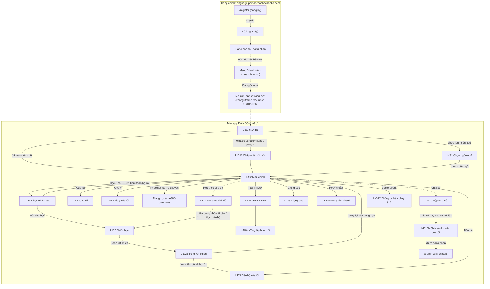

# Sơ đồ điều hướng cửa sổ: bản cũ

Nét liền: thao tác xác nhận được trên trang thật hoặc trong code. Nét đứt: chưa xác nhận (cửa sổ có thật nhưng vị trí nút mở chưa rõ, hoặc phần trang chính sau đăng nhập chưa kiểm trực tiếp, xem `README.md` mục "Đang chờ xác nhận"). Mã màn hình có tiền tố `L-`; chi tiết từng màn ở `ui-spec.md`.

Ngoài sơ đồ: nút nổi `pwa-update` "Có bản mới · Cập nhật" tự hiện khi service worker có bản mới; bấm vào thì tải lại trang.
