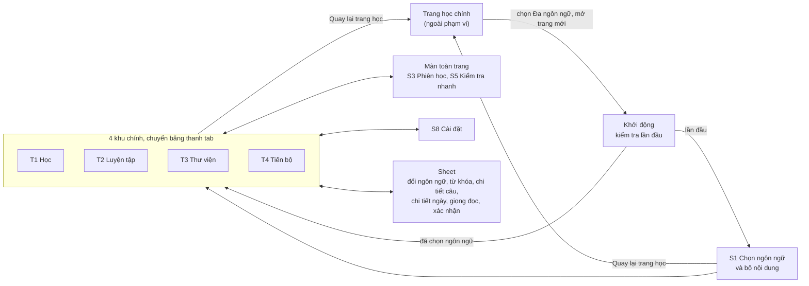
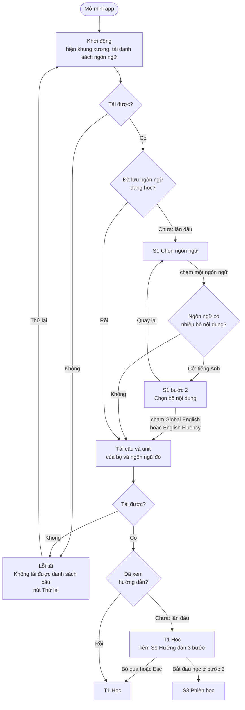
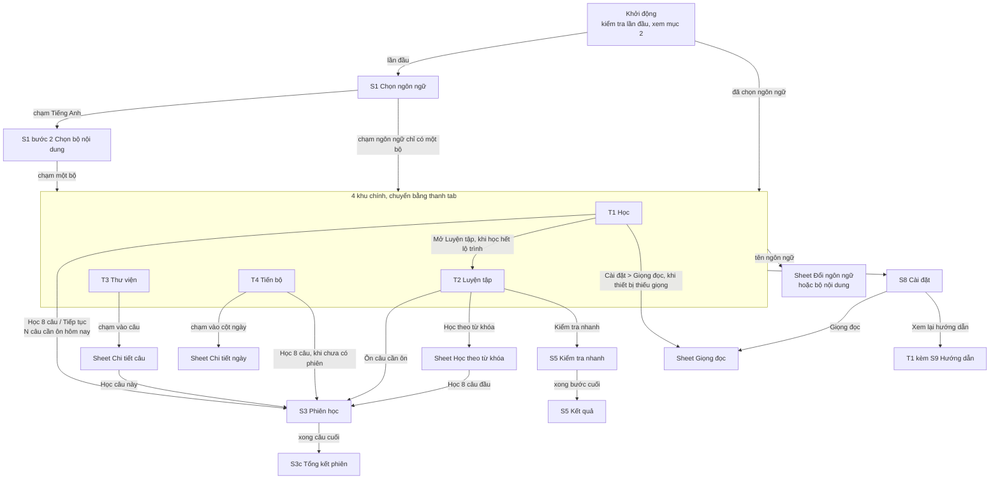
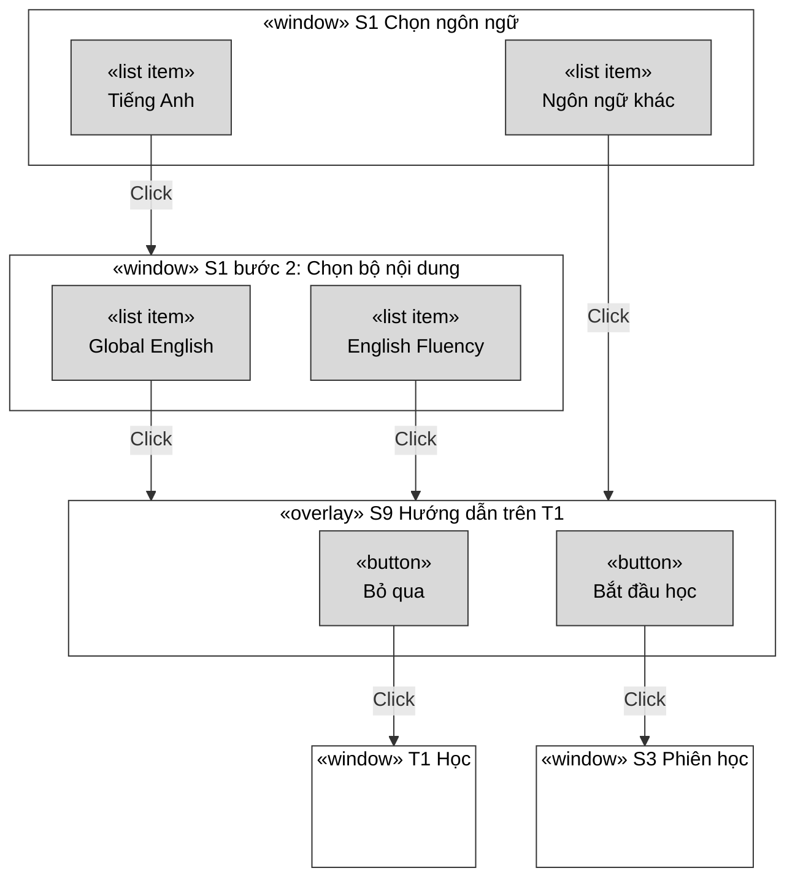
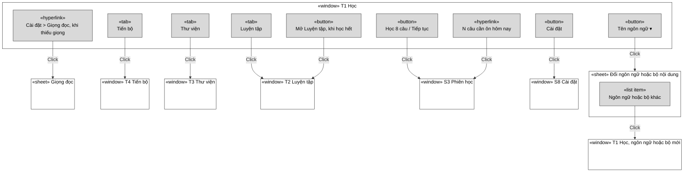
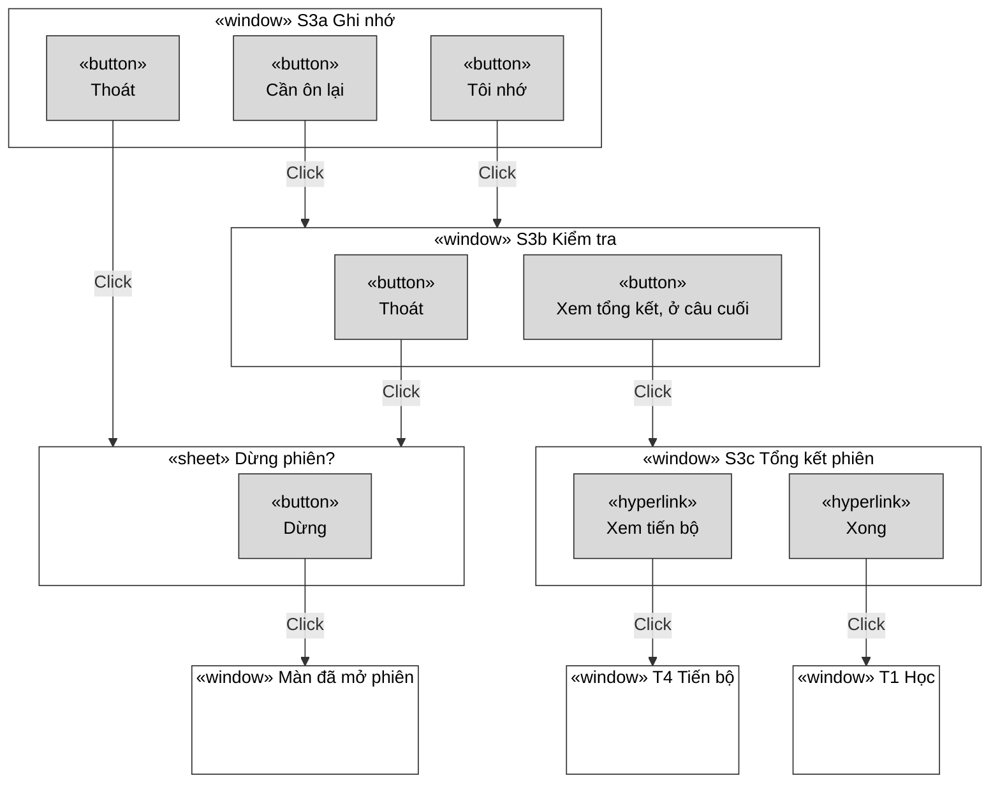
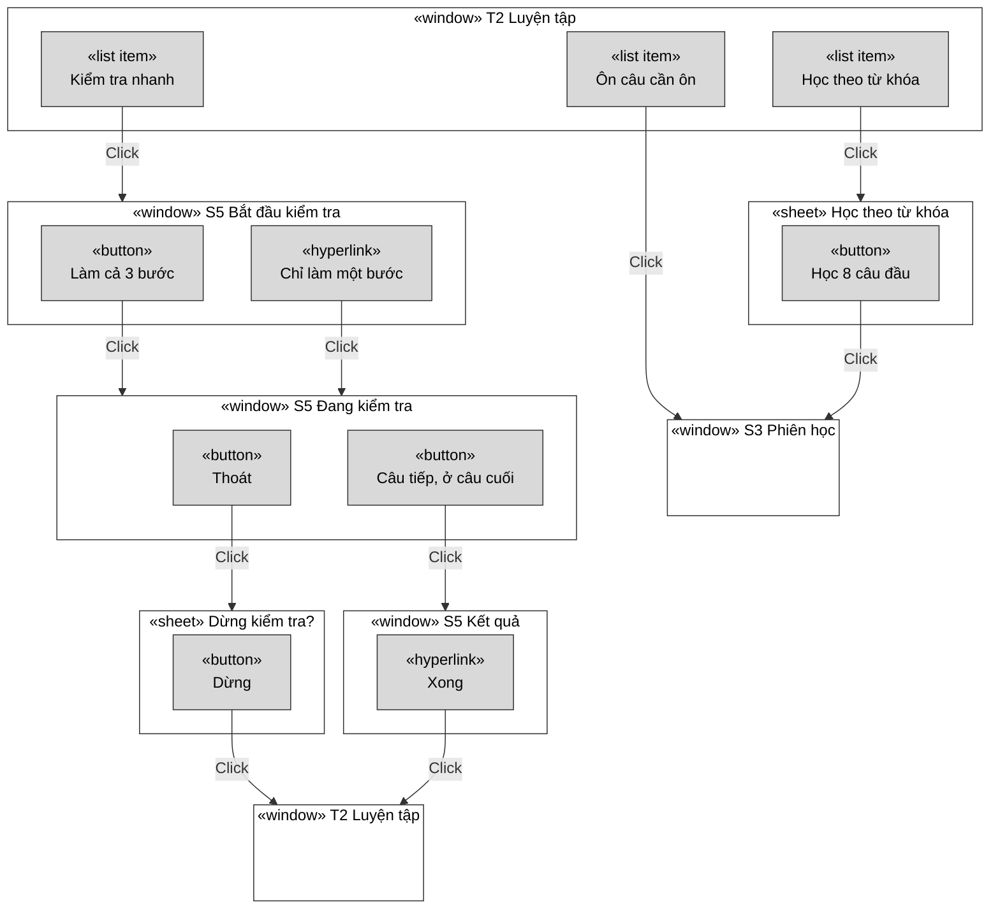
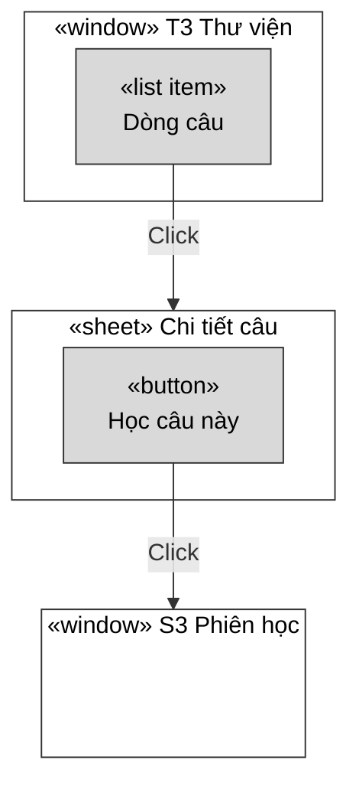
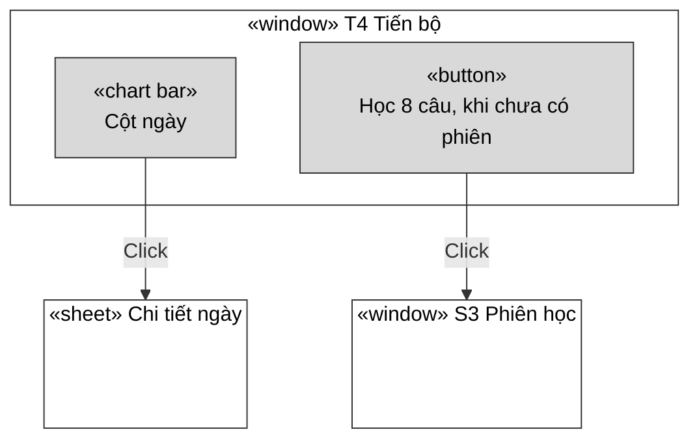
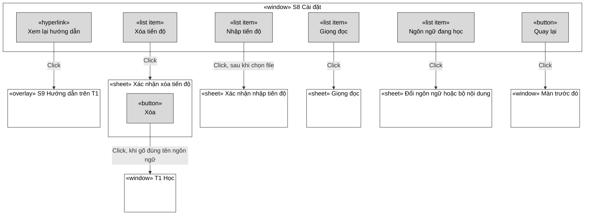

# Sơ đồ điều hướng: bản mới

Các sơ đồ trong file này là hình minh họa. Nguồn chân lý cho điều hướng là bảng route APP-04 trong `fe/src/app/spec.md` và các yêu cầu điều hướng trong spec của từng trang. Khi hai nơi khác nhau, spec thắng; sửa sơ đồ cho khớp.

Mỗi mũi tên trong sơ đồ có một dòng chú thích `%% @spec <ID>` ngay bên dưới, trỏ tới yêu cầu quy định mũi tên đó (hoặc `%% @none <lý do>` nếu nằm ngoài phạm vi). Dòng chú thích không hiện khi render. `npm run spec:check` báo lỗi khi một mũi tên chưa được gắn yêu cầu hoặc trỏ tới yêu cầu không tồn tại; bảng ánh xạ đầy đủ sinh ra ở `docs/generated/navigation-trace.md`.

File gồm bốn mức, từ khái quát tới chi tiết:

1. Sơ đồ tổng quát: các khối lớn của app.
2. Luồng khởi động: kiểm tra lần đầu, chọn ngôn ngữ, rồi mới vào T1.
3. Điều hướng giữa các màn: mọi đường đi giữa màn, màn toàn trang và sheet.
4. Sơ đồ cửa sổ: từng cửa sổ với các nút bên trong và cửa sổ mà mỗi nút mở ra.

## 1. Sơ đồ tổng quát

## 2. Luồng khởi động

Người học chỉ vào được T1 sau khi app tải xong danh sách ngôn ngữ và đã có ngôn ngữ đang học. Lần đầu mở app thì phải qua S1 Chọn ngôn ngữ; nếu chọn tiếng Anh thì chọn tiếp bộ nội dung (Global English hoặc English Fluency); rồi T1 hiện kèm hướng dẫn 3 bước (S9). Yêu cầu liên quan: APP-05, APP-08, S1-04, S1-07, DATA-13, S9-01.

## 3. Điều hướng giữa các màn

Sơ đồ chỉ vẽ chiều đi tới. Các đường quay về nằm trong bảng ngay dưới.

| Từ | Thao tác | Về | Yêu cầu |
|---|---|---|---|
| S3 Phiên học | Thoát, xác nhận Dừng | Màn đã mở phiên (T1, T2, T3 hoặc T4) | S3-07 |
| S3 Phiên học | Nhóm câu rỗng (ví dụ không còn câu cần ôn) | Màn đã mở phiên, kèm thông báo ngắn | S3-01 |
| S3c Tổng kết phiên | Học tiếp N câu / Nhóm tiếp | S3 Phiên học, nhóm câu mới | S3-06 |
| S3c Tổng kết phiên | Xem tiến bộ | T4 Tiến bộ | S3-06 |
| S3c Tổng kết phiên | Xong | T1 Học | S3-06 |
| S5 Kiểm tra nhanh | Thoát, xác nhận Dừng | T2 Luyện tập | S5-08 |
| S5 Kết quả | Kiểm tra unit tiếp theo | S5 Kiểm tra nhanh, unit sau | S5-07 |
| S5 Kết quả | Xong | T2 Luyện tập | S5-07 |
| Sheet Đổi ngôn ngữ | Chọn ngôn ngữ hoặc bộ nội dung khác | T1 Học của ngôn ngữ hoặc bộ đó | APP-06 |
| S1 bước 2 Chọn bộ nội dung | Quay lại | S1 danh sách ngôn ngữ | S1-07 |
| S8 Cài đặt | Quay lại | Khu chính vừa mở S8 | APP-04 |
| T1 đến T4, S1 bước 1 | Quay lại trang học | Trang học chính (rời app) | APP-12 |
| S8 Cài đặt | Ngôn ngữ đang học | Sheet Đổi ngôn ngữ | S8-01 |
| S8 Cài đặt | Xóa tiến độ, xác nhận | T1 Học | S8-05 |
| Mọi sheet | Đóng | Cửa sổ đã mở sheet | C6-02 |

## 4. Sơ đồ cửa sổ

Ký hiệu, theo kiểu sơ đồ cửa sổ UML:

| Ký hiệu | Nghĩa |
|---|---|
| «window» | Một màn: khu chính, màn toàn trang hoặc S8 |
| «sheet» | Lớp phủ trượt từ dưới lên (C6); từ 900 px là hộp thoại giữa màn |
| «overlay» | Lớp phủ hướng dẫn S9 nằm trên T1 |
| «button», «hyperlink», «tab», «list item», «chart bar» | Phần tử trong cửa sổ |
| Mũi tên Click | Bấm phần tử đó thì mở cửa sổ ở đầu mũi tên |

Chỉ vẽ các phần tử dẫn sang cửa sổ khác và chỉ vẽ chiều đi tới, giống sơ đồ cửa sổ UML thông thường. Đường quay lại (nút Đóng của sheet, Hủy, Học tiếp sau khi xác nhận) ghi bằng chữ dưới mỗi sơ đồ. Mọi sheet có nút Đóng, đóng thì về đúng cửa sổ đã mở nó. Phần tử chỉ đổi trạng thái tại chỗ (Nghe, Xem gợi ý, bộ lọc, phân trang) không vẽ. Thanh tab có ở T1 đến T4 và S8, chỉ vẽ một lần ở mục 4.2.

### 4.1 Chọn ngôn ngữ, bộ nội dung và hướng dẫn lần đầu

Nút Quay lại ở bước chọn bộ về danh sách ngôn ngữ (S1-07). Nút Tiếp chuyển giữa bước 1/3, 2/3, 3/3 trong cùng lớp phủ; ở bước 3/3 nút chính là Bắt đầu học (S9-03). Hướng dẫn không hiện khi T1 đang ở trạng thái học hết lộ trình (S9-01) và không tự hiện lại sau khi xong hoặc bỏ qua (S9-04).

### 4.2 T1 Học và thanh tab

Thanh tab giống nhau ở T1 đến T4 và S8 (APP-01, S8). Nút Tên ngôn ngữ và Cài đặt có ở mọi khu chính (APP-02). Liên kết tới sheet Giọng đọc khi thiết bị thiếu giọng nằm trong thẻ câu (C1-05), nên cũng có ở S3 và sheet Chi tiết câu của T3.

### 4.3 S3 Phiên học

Đường quay lại: ở S3b, nút Câu tiếp về S3a của câu sau (S3-02, S3-04). Ở sheet Dừng phiên, nút Học tiếp đóng sheet và giữ nguyên câu đang dở (S3-07). Ở S3c, nút Học tiếp N câu (hoặc Nhóm tiếp khi học theo từ khóa) bắt đầu phiên mới ở S3a (S3-06).

### 4.4 T2 Luyện tập và S5 Kiểm tra nhanh

Đường quay lại: ở S5 Kết quả, nút Kiểm tra unit tiếp theo về S5 Bắt đầu kiểm tra với unit sau (S5-07). Ở sheet Dừng kiểm tra, nút Làm tiếp đóng sheet (S5-08).

### 4.5 T3 Thư viện

Từ 900 px, chi tiết câu hiện ở cột phải của T3 thay cho sheet (T3-07).

### 4.6 T4 Tiến bộ

### 4.7 S8 Cài đặt

Đường quay lại: sheet Giọng đọc (nút Xong, S8-02), Xác nhận nhập tiến độ và Xác nhận xóa tiến độ (đóng theo C6-02) đều về S8.

## 5. So sánh với bản cũ

| | Bản cũ | Bản mới |
|---|---|---|
| Số cửa sổ người dùng gặp | Màn chính và 15 hộp thoại | 4 tab, màn Cài đặt, 3 màn toàn trang, 6 loại sheet (đổi ngôn ngữ, từ khóa, chi tiết câu, chi tiết ngày, giọng đọc, xác nhận) |
| Hộp thoại chồng hộp thoại | Có (Tổng kết mở Tiến bộ trong cùng hộp thoại; Chia sẻ mở hộp quản lý bên trong hộp chia sẻ) | Không |
| Lối vào luyện tập | Rải rác: Học 8 câu, TEST NOW, Học theo chủ đề nằm ở 3 chỗ | Gom vào tab Luyện tập; T1 chỉ giữ lối vào học tiếp |

Sơ đồ bản cũ: `docs/legacy/navigation.md`.
