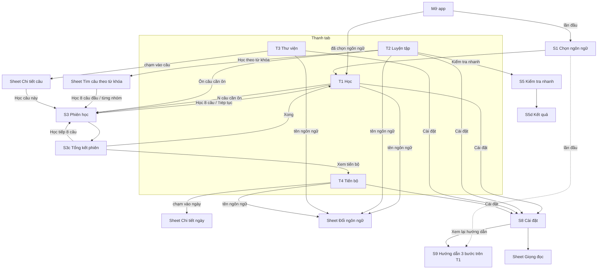

# Sơ đồ điều hướng cửa sổ: bản mới

Sơ đồ này là hình minh họa. Nguồn chân lý cho điều hướng là bảng route APP-04 trong `fe/src/app/spec.md` và các yêu cầu điều hướng trong spec của từng trang. Khi hai nơi khác nhau, spec thắng; sửa sơ đồ cho khớp.

## So sánh với bản cũ

| | Bản cũ | Bản mới |
|---|---|---|
| Số cửa sổ người dùng gặp | Màn chính và 15 hộp thoại | 4 tab, màn Cài đặt, 3 màn toàn trang, 6 loại sheet (đổi ngôn ngữ, từ khóa, chi tiết câu, chi tiết ngày, giọng đọc, xác nhận) |
| Hộp thoại chồng hộp thoại | Có (Tổng kết mở Tiến bộ trong cùng hộp thoại; Chia sẻ mở hộp quản lý bên trong hộp chia sẻ) | Không |
| Lối vào luyện tập | Rải rác: Học 8 câu, TEST NOW, Học theo chủ đề nằm ở 3 chỗ | Gom vào tab Luyện tập; T1 chỉ giữ lối vào học tiếp |

Sơ đồ bản cũ: `docs/legacy/navigation.md`.
